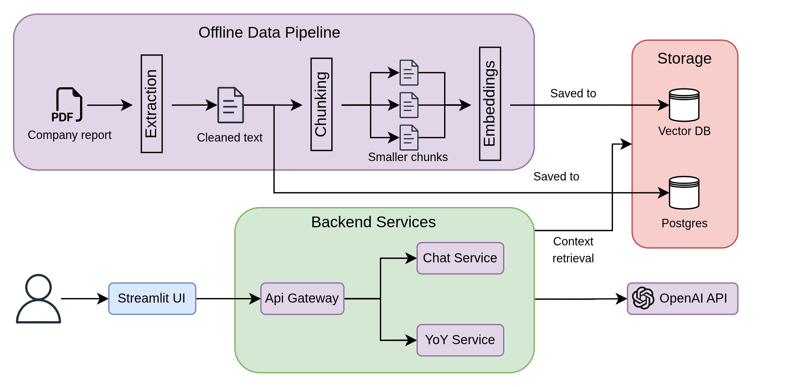
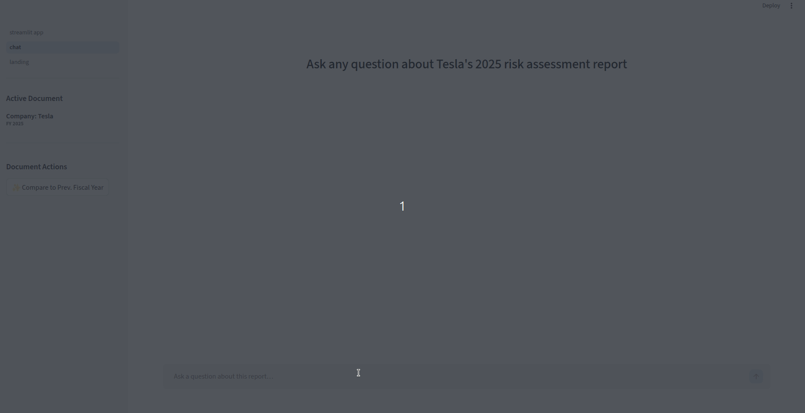
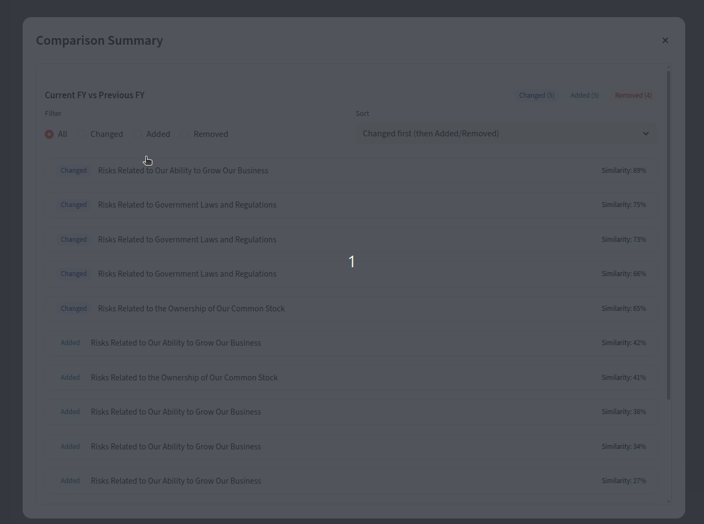
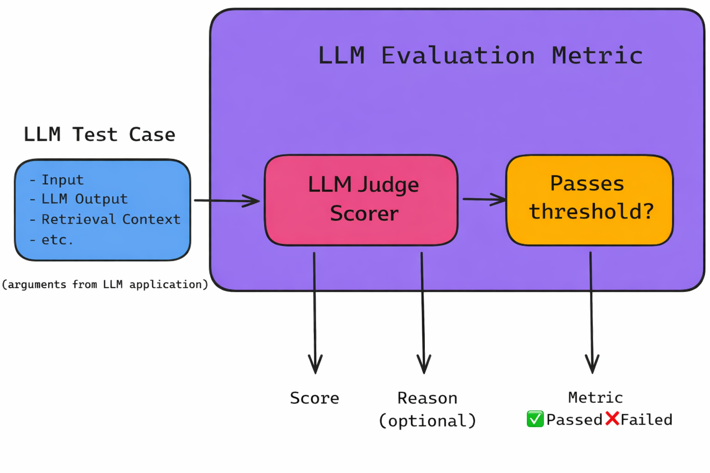

## 10-K Risk Analysis RAG Assistant

A production-style **Retrieval-Augmented Generation (RAG)** system designed to analyze SEC **10-K Risk Factors**. This tool moves beyond basic search by offering deep semantic comparison and grounded synthesis of financial disclosures.

### Core Capabilities

* **Grounded Q&A Chatbot:** Perform deep-dives into specific filings using an LLM-as-a-Judge verified pipeline. The system provides answers with **exact source citations**, ensuring every claim is backed by the original 10-K text.
* **YoY (Year-over-Year) Change Detection:** Automated comparison of filings across fiscal years. The system identifies and categorizes **added, removed, and modified** risk paragraphs, generating concise bullet summaries of how a company's risk profile has evolved.

Built using best AI Engineering best practices, such as clean architectural boundaries, repeatable ingestion pipelines, and a rigorous evaluation harness to ensure scalability.

### 💬 Grounded Q&A Chat

*Querying specific 10-K risk factors with automated source attribution and metadata extraction.*

### 📊 YoY (Year-over-Year) Change Detection

*Automated delta analysis identifying added, removed, and modified risk disclosures between fiscal years.*


---
## Tech stack

- **FastAPI** (API)
- **Qdrant** (vector database)
- **PostgreSQL** (document + metadata storage)
- **Ollama** (`nomic-embed-text`) for embeddings
- **OpenAI** for generation
- **Streamlit** UI
- **DeepEval** evaluation (LLM-as-judge metrics)
---


## Evaluation & Performance

To ensure the system is production-ready, we implemented an automated evaluation pipeline using **DeepEval** and **LLM-as-a-Judge**. This framework uses a stronger model to score the RAG system's outputs against a "Golden Dataset" derived from Microsoft's 2025 10k report.

The evaluation measures two critical dimensions of RAG performance:
1.  **Retrieval Metrics:** Is the system finding the right data? (Precision/Recall)
2.  **Generation Metrics:** Is the LLM answering correctly and sticking to the facts? (Relevancy/Faithfulness)



### Benchmark Results (Feb 2026)

Test run using `gpt-4.1-mini` for generation and `nomic-embed-text` for retrieval ($k=6$).

| Metric | Score | Pass Rate | What it measures |
| :--- | :--- | :--- | :--- |
| **Answer Relevancy** | **1.00** | 100% | Does the system directly answer the user's specific question? |
| **Faithfulness** | **0.98** | 100% | Is the answer derived *only* from the retrieved context? (Hallucination check) |
| **Contextual Recall** | **0.80** | 80% | Did the retrieval system find *all* the necessary information in the database? |
| **Contextual Precision** | **0.78** | 80% | How much signal vs. noise was in the retrieved chunks? |

### Key Findings & Analysis

* **Zero Hallucinations (High Faithfulness):** The system achieved a near-perfect faithfulness score (0.98), confirming that the prompt engineering effectively grounds the model. The system refuses to invent information when context is missing.
* **High User Alignment:** The perfect 1.0 score in relevancy demonstrates that the generation layer effectively parses user intent, even for complex financial queries regarding risk factors.
* **Retrieval Trade-offs:** The retrieval metrics (Precision 0.78 / Recall 0.80) indicates that while the system answers 80% of queries perfectly, the remaining 20% represent edge cases where the embedding model struggled to distinguish specific financial nuances (e.g., distinguishing specific "margin risks" from general "investment risks").

### Running the Evaluation

You can reproduce these benchmarks by running the DeepEval suite:

```bash
python -m app.deepeval_eval.eval_rag
```
---

## Architecture

### API Layer (`api`)
- **FastAPI** routers for chat, comparison, and document listing.
- Clean dependency injection and wiring via `dep.py`.

### Service Layer (`services`)
- **Chat Service:** Orchestrates the retrieval → prompt construction → generation flow.
- **Comparison Service:** Handles YoY diffing logic and automated change summarization.

### Ingestion Layer (`ingestion`)
- Robust pipelines for parsing, markdown conversion, chunking, and vector indexing.
- Modular entry points for Postgres (metadata), Qdrant (chatbot), and YoY comparison collections.

### Storage & Data Layout (`data/`, `output/`)
- **Input Management:** Centralized `index.json` for tracking document metadata (ID, company, fiscal year).
- **Structured Output:** Per-company directory structure containing cleaned Markdown (optimized for table retention) and JSON-serialized chunks with associated metadata.

### Data Contracts (`data_classes.py`, `models.py`)
- **Pydantic** models for strict enforcement of API and config contracts.
- **SQLAlchemy** models for persistent document and metadata storage in PostgreSQL.

### Clients & UI Boundary
- **Clients:** Low-latency wrappers for Qdrant and OpenAI.
- **UI (`ui`):** Streamlit frontend decoupled from core logic to allow for modularity.

---


## Setup

1) Clone the repo:
```bash
git clone https://github.com/parepic/report_assistant.git
cd report_assistant
```

2) Configure OpenAI (primary generator):
- Set `OPENAI_API_KEY` via env var or a `.env` file in the repo root.

3) Install Ollama (embeddings):
- Install: https://ollama.ai/
- Pull the embedding model:
```bash
ollama pull nomic-embed-text
```

4) Install dependencies (Python ≥ 3.11 via PDM):
- Install PDM: https://pdm.fming.dev/latest/#installation
```bash
pdm use python
pdm install
# When collaborators update pyproject/lock:
pdm sync
```

5) Start Qdrant + PostgreSQL:
```bash
docker-compose up -d
```

---

## Usage

### Ingestion pipelines

Three pipelines cover database ingestion, chatbot indexing, and YoY indexing:

```bash
python -m app.ingestion.pipeline_db
# Parse filing → store markdown in PostgreSQL

python -m app.ingestion.pipeline_chatbot
# Chunk + embed for chatbot retrieval

python -m app.ingestion.pipeline_comparison
# Chunk + embed for YoY comparison (separate collection)
```

You can run a single stage too. For example:
```bash
pdm run python pipeline_chatbot.py --chunk
```

Or combine stages:
```bash
pdm run python pipeline_chatbot.py --chunk --embed
```

---

## FastAPI Server

Start the FastAPI backend server:

```bash
pdm run uvicorn app.main:app --reload
```

The server will be available at `http://localhost:8000`. The `--reload` flag enables auto-restart on code changes during development.

---

## UI

To use the full application, you must run **both the FastAPI server and Streamlit UI** in separate terminals.

First, start the FastAPI server (see section above), then run the Streamlit app:
```bash
pdm run streamlit run ui/streamlit_app.py
```

More details live in `ui/README.md`.

---

## Config

`global.yaml` controls major components (LLM model, embedding model, chunking strategy) to speed up experimentation.

